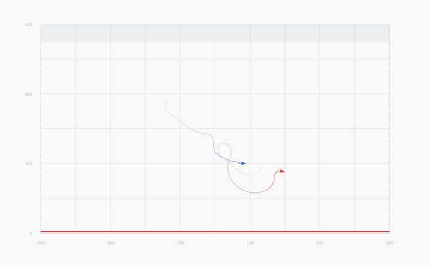

# Dogfight Challenge



Train a neural network to win a 2D dogfight. Submit a single ONNX file. The sim does the rest.

Your model sees 224 floats describing the battlefield — your fighter, the opponent, incoming bullets — and outputs 3 floats: turn, throttle, shoot. Matches run at 120Hz physics with your model making decisions at 12Hz. Beat the built-in opponents, then compete against other players in a round-robin tournament.

---

## What You Need to Submit

A **stateless ONNX model**. That's it.

| | |
|---|---|
| **Input** | `float32[1, 224]` — 4 stacked observation frames |
| **Output** | `float32[1, 3]` — `[yaw_input, throttle, shoot]` |
| **Decision rate** | 12 Hz (every 10 physics ticks) |
| **Max parameters** | 250,000 |
| **Max file size** | 10 MB |

Output clamping: yaw `[-1, 1]`, throttle `[0, 1]`, shoot fires if `> 0`.

---

## Quick Start

```bash
# Build
make build

# Validate your model meets the spec
make validate MODEL=models/starter.onnx

# Fight the strongest built-in opponent
make run P0=models/starter.onnx P1=brawler

# Watch in the browser
make serve    # Terminal 1 — backend on :3001
make viz      # Terminal 2 — frontend on :3000
```

Open [http://localhost:3000](http://localhost:3000) to watch matches live.

---

## Human Keyboard Play (Optional)

You can fly **Player 0** manually in the web app:

1. Start backend + frontend:
   - `make serve`
   - `make viz`
2. In **Match Setup**, set **Your Model (Blue)** to `Human (Keyboard)`.
3. Pick any opponent for **Player 1** and start a match.

Keyboard controls:
- Turn: `A/D` or `Left/Right`
- Throttle: `W/S` or `Up/Down`
- Shoot: `Space`
- Debug panel toggle: `P`

Visualizer camera is fixed and centered on the arena (no pan/zoom controls).

---

## The Game

Two fighters spawn in a 2D side-view arena and have 90 seconds to fight.

| | |
|---|---|
| **Arena** | 1000m wide, 600m tall |
| **Boundaries** | Horizontal edges wrap around. Ground (y ≤ 5m) is fatal. Ceiling zone (above 550m) drains speed |
| **Physics** | Gravity-based energy model — climbing costs speed, diving gains it |
| **HP** | 5 per fighter. 0 = eliminated |
| **Bullets** | 400 m/s, ~200m range, 0.75s cooldown |
| **Rear-aspect armor** | Bullets from within 45° behind glance off — attack from the front or side |
| **Stall** | Below 30 m/s, your fighter loses control until speed recovers |
| **Damage** | Each HP lost reduces max speed by 3% and turn rate by 2% |
| **Win** | Eliminate your opponent, or have more HP when time runs out |

### Scoring (Tournament)

| Outcome | Points |
|---------|--------|
| Win by elimination | 3 |
| Win by HP at timeout | 2 |
| Draw | 1 |
| Loss | 0 |

---

## What Your Model Sees (224 floats)

4 stacked frames of 56 floats each: `[current, t-1, t-2, t-3]`

```
Self state [0..8)
  speed, cos(yaw), sin(yaw), hp, gun_cooldown, altitude, x_position, energy

Opponent state [8..19)
  rel_x, rel_y, speed, cos(yaw), sin(yaw), hp, distance,
  closure_rate, angular_velocity, energy, angle_off_tail

Bullets [19..51) — 8 nearest bullets × 4 floats
  rel_x, rel_y, is_friendly, angle

Relative geometry [51..55)
  angle_off_nose, opp_angle_off_nose, rel_vel_x, rel_vel_y

Meta [55]
  ticks_remaining
```

All values normalized to roughly [-1, 1]. Exact normalization constants in [`RULES.md`](RULES.md).

---

## Built-in Opponents

Test your model against these, from weakest to strongest:

| Policy | Style |
|--------|-------|
| `dogfighter` | Mode-switches between attack, defend, energy management |
| `chaser` | Relentless pursuit with yo-yo maneuvers |
| `ace` | Energy fighting, perpendicular breaks, altitude advantage |
| `brawler` | Close-range turn fighting, exploits rear-aspect armor |

Built-in opponents run as native Rust code in the server — no ONNX approximation.

---

## CLI Reference

```bash
make build                                    # Build everything
make run P0=chaser P1=ace SEED=42             # Single match
make run P0=models/starter.onnx P1=brawler    # Test your model
make tournament POLICIES=chaser,ace,brawler ROUNDS=10
make validate MODEL=models/starter.onnx       # Check spec compliance
make serve                                    # WebSocket server (:3001)
make viz                                      # Frontend dev server (:3000)
make test                                     # Run all tests
```

---

## Project Structure

```
crates/
  shared/      Constants, types, observation layout
  sim/         Physics engine, Policy trait, scripted opponents
  validator/   ONNX model validation (shape, size, speed)
  server/      WebSocket server — streams match frames
  cli/         CLI: run, serve, tournament, validate

models/        User models — starter.onnx included as a starting point
viz/           Next.js + React Three Fiber frontend
```

Full competition rules and observation details in [`RULES.md`](RULES.md).
